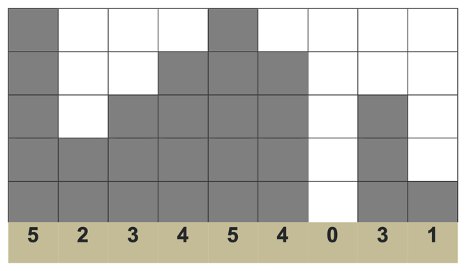
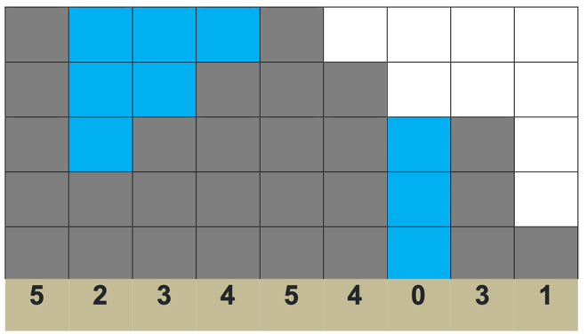

Task: There is a landscape with hills and pits which have similar square shape. Each position in this landscape has a specified height. Max number of positions is 32000. 

Height is between 0 and 32000.

For example: the first position has height 5, the second position has height 2. The landscape can be presented as a collection of heights. {5,2,3,4,5,4,0,3,1}

When rain happens, landscape is filled with water. Water is collected inside pits only between hills. For example: collected 9 squares of water.

You need to:
- implement an application which calculates amount of collected water for any landscapes. Water calculator should implement method long calculateWaterAmount(int[] landscape)
- validate correctness of landscape
- cover this application with tests (TDD)
- use maven to build the application

# Solution

Solution has O(n) complexity and O(n) memory complexity.

Possible optimizations:
- Validate landscape height inside main loop
- Use one array for `leftMaxLevels` and `rightMaxLevels`. Height couldn't be more than 32000 (fit in 2^15) and int in java is 2^32. So it's possible to store to numbers in one int with certain manipulations.
- Or even don't use additional arrays at all. Use `int[] landscape` to keep `landscape height` and `leftMaxLevels` in first loop. And calculate `rightMaxLevels` and result in second loop.